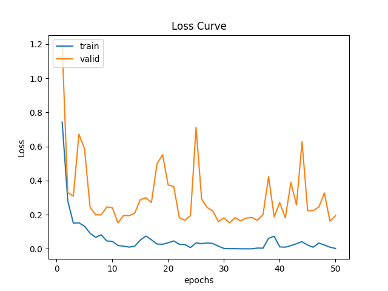

# ML_hw1_Result
#### 1.要完整運作請執行 __hw1.py__
#### 2.Dataset請至此下載[Plant Seedlings Classification](https://www.kaggle.com/c/plant-seedlings-classification/data)
## 1. Loss Curve

## 2. Acc Curve

## 3. Resnet_50 Predict Result

## 4. VGG16 Predict Result

